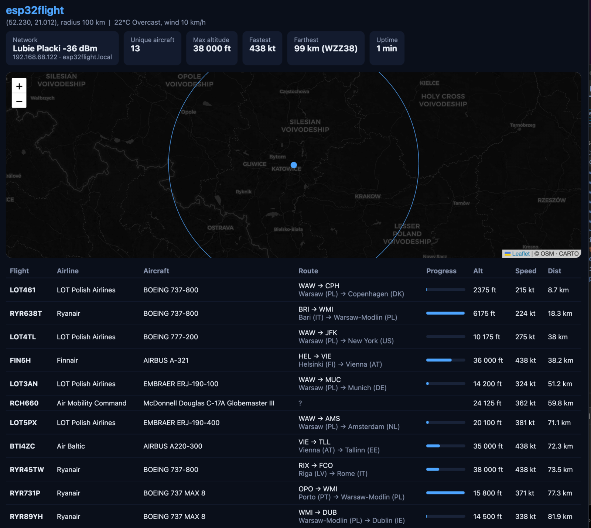

# esp32flight

A standalone desktop flight radar for the **Waveshare ESP32-S3-Touch-LCD-7**
(800×480). It shows live aircraft around your location with airline logos,
routes, flight progress, a route map, radar view, weather, and a built-in web
panel with OTA updates. No Raspberry Pi, no server - one ESP32 board.

**[Flash it from your browser](https://theqkash.github.io/esp32flight/)** (Chrome/Edge,
no tools needed) or grab binaries from
[Releases](https://github.com/theqkash/esp32flight/releases).

## Screenshots

| | |
|---|---|
|  |  |
|  |  |
|  |  |

Web panel with live map, stats and OTA:



## Features

- **Live flight list** within a configurable radius (10–250 nm) - callsign,
  airline logo, aircraft type, altitude, speed, distance
- **Flight details**: airline name, route with city + country, progress bar,
  ETA with arrival time, aircraft photo (planespotters.net)
- **Route map**: full-screen world map with the great-circle track and live
  aircraft position
- **Auto (ambient) mode**: aircraft cycle automatically with a persistent
  map + info bubble - flight-tracker-on-the-shelf style
- **Radar view**: home-centered rings with aircraft plotted by bearing/distance
- **Weather** in the header (Open-Meteo): icon, temperature, wind
- **Emergency alert** for squawk 7700/7500/7600
- **On-device settings** (touch): Wi-Fi scan + join, city search geocoding,
  fixed/auto (IP) location, radius, filters (ground traffic, airline-only),
  7 color themes, English/Polish UI
- **Web panel** at `http://esp32flight.local` - live flight table, Leaflet
  map, session stats, network info, `/screen.bmp` screenshots and **OTA
  firmware updates** from the browser

## Data sources (all free, no API keys)

| What | Source |
|---|---|
| Aircraft positions (ADS-B) | [airplanes.live](https://airplanes.live), fallback [adsb.lol](https://adsb.lol) |
| Routes + airlines | [adsbdb.com](https://www.adsbdb.com), fallback [hexdb.io](https://hexdb.io) |
| Geocoding + weather | [Open-Meteo](https://open-meteo.com) |
| IP geolocation | [ip-api.com](https://ip-api.com) |
| Aircraft photos | [planespotters.net](https://www.planespotters.net) via adsbdb |
| Airline logos | [sexym0nk3y/airline-logos](https://github.com/sexym0nk3y/airline-logos), [Jxck-S/airline-logos](https://github.com/Jxck-S/airline-logos) |
| World map | NASA Blue Marble |

Routes resolved from callsigns are **position-validated** (great-circle
plausibility check) and cross-checked against the second source, because
callsign→route databases are sometimes stale.

## Hardware

Waveshare ESP32-S3-Touch-LCD-7: ESP32-S3 (16 MB flash, 8 MB PSRAM), 800×480
RGB LCD (ST7262), GT911 capacitive touch, CH343 USB-UART.

## Building

Requires ESP-IDF ≥ 5.5, ImageMagick and Node (for asset generation).

```sh
# one-time: fetch airline logos + generate fonts (Latin Ext A/B + icons)
./tools/fetch_logos.sh
./tools/gen_fonts.sh

idf.py set-target esp32s3
idf.py -p /dev/cu.usbmodemXXXX -b 230400 flash
```

First boot: tap the gear icon, pick your Wi-Fi from the scan list, type the
password on the on-screen keyboard, save. Subsequent updates can be done
over the air from the web panel (`build/esp32flight.bin`).

## License

MIT © [Łukasz Nowak (@theqkash)](https://github.com/theqkash)

Display bring-up adapted from Waveshare's demo code (CC0). Built with
[LVGL](https://lvgl.io) 8 and ESP-IDF.
